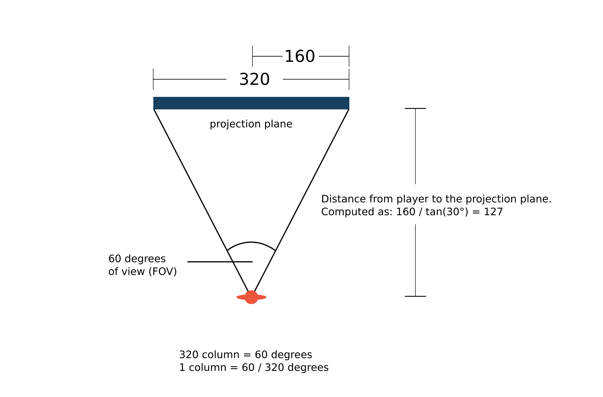
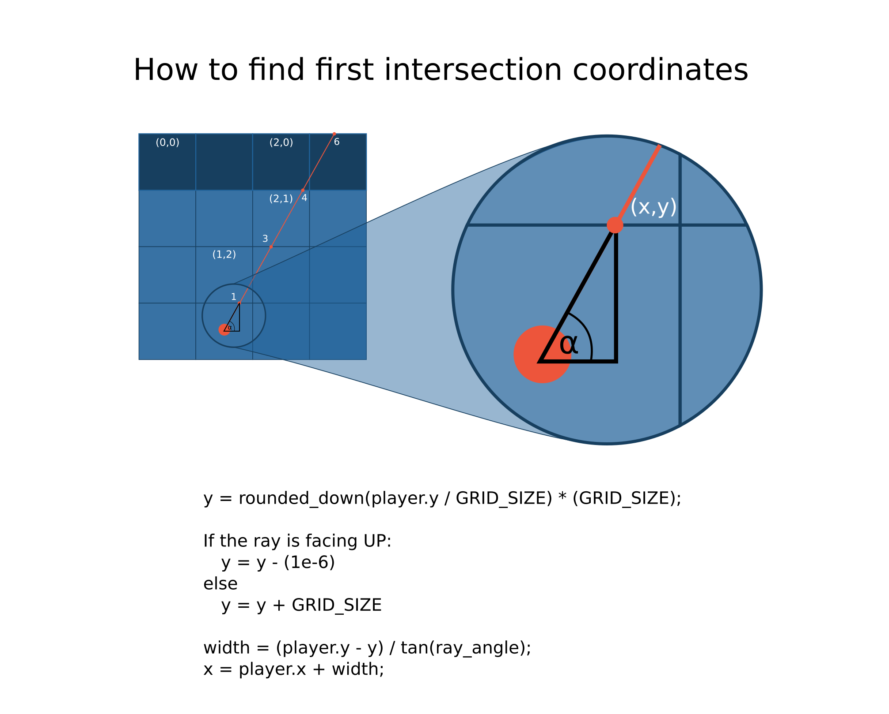

# Raycast tutorial

- [Raycast tutorial](#raycast-tutorial)
  - [STEP 1: creating a world](#step-1-creating-a-world)
  - [STEP 2: Defining projection attributes](#step-2-defining-projection-attributes)
  - [STEP 3: Finding walls](#step-3-finding-walls)
      - [Steps of finding intersections with horizontal grid lines:](#steps-of-finding-intersections-with-horizontal-grid-lines)
        - [1. Finding y_increment](#1-finding-y_increment)
        - [2. Finding x_increment](#2-finding-x_increment)
        - [3. We can get the coordinate of the next intersection as follows:](#3-we-can-get-the-coordinate-of-the-next-intersection-as-follows)
        - [4. Convert this into grid coordinate by dividing each component with GRID_SIZE.](#4-convert-this-into-grid-coordinate-by-dividing-each-component-with-grid_size)
        - [5. repeat the process until we hit a wall.](#5-repeat-the-process-until-we-hit-a-wall)
      - [Steps of finding intersections with vertical grid lines:](#steps-of-finding-intersections-with-vertical-grid-lines)
        - [1. Find coordinate of the first intersection (point 2 in this example).](#1-find-coordinate-of-the-first-intersection-point-2-in-this-example)
        - [2. Find x_increment.](#2-find-x_increment)
        - [3. Find y_increment](#3-find-y_increment)
        - [4. Check the grid at the intersection point.](#4-check-the-grid-at-the-intersection-point)

## STEP 1: creating a world

To illustrate the process of ray-casting, we will create a maze world that has the following geometric constraints:

    1. Walls are always at 90° angle with the floor.
    2. Walls are made of cubes that have the same size.
    3. Floor is always flat.

For our purpose, each cube will have the size of 64x64x64 units. (The choice of 64 is arbitrary, but it will be useful to pick a number that is a multiple of 2; because we can perform some arithmetic shift operations on such number (shift operations are faster than multiplication or division). The larger the size of the cube, the blockier the world will look like, but smaller cube will make the rendering slower.)

Before continuing, we will define our coordinate system so that there is no confusion. The coordinate system that we use is:

**Note:** Any kind of cartesian coordinate system would work just as well. However, you do have to be consistent (don’t use the top-down coordinate system for one thing but then use the buttom-up coordinate for others). You’d be likely to confuse yourself if you do this – I did.

## STEP 2: Defining projection attributes

Now that we have the world, we need to define some attributes before we can project and render the world. Specifically, we need to know these attributes:

    1. Player/viewer’s height, player’s field of view (FOV), and player’s position.
    2. Projection plane’s dimension.
    3. Relationship between player and projection plane.

The player should be able to see what is in front of him/her. For this, we will need to define a field of view (FOV). The FOV determines how wide the player sees the world in front of him/her. Most humans have a FOV of 90 degrees or more. However, FOV with this angle does not look good on screen. Therefore, we define the FOV to be 60 degrees through trial and experimentation (on how good it looks on screen). The player’s height is defined to be 32 units because this is a reasonable assumption considering that walls (the cubes) are 64 units high.

To put the player inside the world, we need to define the player’s X coordinate, the player’s Y coordinate, and the angle that the player is facing to. These three attributes forms the “point of view” of the player.

Suppose that the player is put somewhere in the middle of grid coordinate (1,2) at a viewing angle of 45 degrees relative to the world, then the player’s point of view and FOV will be like in the following image (One grid consist is 64 x 64 units. Thus, we can also say that the player is in unit coordinate (96,160)).

We need to define a projection plane so that we can project what the player sees into the projection plane. A projection plane of 320 units wide and 200 units high is a good choice, since this is the resolution of most VGA video cards. (Video resolution is usually referred in pixels, so think of 1 pixel as equal to 1 unit.)
When the player’s point of view is projected into the projection plane, the world should look like the scene below.

  

By knowing the field of view (FOV) and the dimension of the projection plane, we can calculate the angle between subsequent rays and the distance between the player and the projection plane. These steps are illustrated in the figure above (Many books define these last two values arbitarily, without telling the reader where the values come from, here is the justification.)

Here is what we can calculate (most of these are high school level math, I recommend brushing up on Trigonometry/Pythagorean theorem if you don’t understand):

So now we know:

    Dimension of the Projection Plane = 320 x 200 units
    Center of the Projection Plane = (160,100)
    Distance to the Projection Plane = 277 units
    Angle between subsequent rays = 60/320 degrees

(We will occasionally refer the “angle between subsequent rays” as the “angle between subsequent columns.” Later, this angle will be used to loop from column to column. The distance between player to the projection plane will be used for scaling.)

## STEP 3: Finding walls

Notice from the previous image, that the wall can be viewed as collection of 320 vertical lines (or 320 wall slices).

This is precisely a form of geometrical constraints that will be suitable for ray-casting. Instead of tracing a ray for every pixel on the screen, we can trace for only every vertical column of screen. The ray on the extreme left of the FOV will be projected onto column 0 of the projection plane, and the right most ray will be projected onto column 319 of the projection plane.

Therefore, to render such scene, we can simply trace 320 rays starting from left to right. This can be done in a loop. The following illustrates these steps:

    1. Based on the viewing angle, subtract 30 degrees (half of the FOV).
    2. Starting from column 0:
        A. Cast a ray. (The term “cast” is a bit confusing. Imagine the player as a wizard who can “cast” rays instead of spells. The ray is just an “imaginary” line extending from the player.)
        B. Trace the ray until it hits a wall.
    3. Record the distance to the wall (the distance is equal to the length of the ray).
    4. Add the angle increment so that the ray moves to the right (we know from Figure 10 that the value of the angle increment is 60/320 degrees).
    5. Repeat step 2 and 3 for each subsequent column until all 320 rays are cast.

The trick to step 2.A is that instead of checking each pixels, we only have to check each grid. This is because a wall can only appear on a grid boundary. Consider a ray being traced as in the figure bellow. To check whether this ray has hit a wall or not, it is sufficient to check the grid intersection points at 1, 2, 3, 4, 5, and 6.

To find walls, we need to check any grid intersection points that are encountered by the ray; and see if there is a wall on the grid or not. The best way is to check for horizontal and vertical intersections separately. When there is a wall on either a vertical or a horizontal intersection, the checking stops. The distance to both intersection points is then compared, and the closer distance is chosen. This process is illustrated in the following two figures.

#Checking Horizontal Intersections

#### Steps of finding intersections with horizontal grid lines:

 - Find coordinate of the first intersection (point 1 in this example).
 - Find y_increment. (Note: y_increment is just the height of the grid; however, if the ray is facing up, y_increment will be negative, if the ray is facing down, y_increment will bepositive.)
 - Find x_icremenet using the equation given above.
 - Check the grid at the intersection point. If there is a wall on the grid, stop and calculate the distance.
 - If there is no wall, extend the to the next intersection point. Notice that the coordinate of the next intersection point

call it **(nextX,nextY)**
**nextX = oldX + x_icremenet**
and
**nextY = oldY + y_increment.**

As an example the following is how you can get the point 1:

   In the picture, the ray is facing up, so we use the first formula.
      
      1.y = rounded_down( 224 / 64 ) * (64) = 192;
   
   The ray is facing up and we want to check the grid above the line, that's why we subtract 1 from it:
      
      1.y = 1.y - 1;
      So the grid coordinate of 1.y is 191 / 64 = 2;
   
   if the ray were facing down, we'd do:
      
      1.y = 1.y + GRID_SIZE) // to check the bellow the line.

   In the picture, (assume ALPHA is 60 degrees),
  
      width = ( 224 - 191 ) / tan(60)
      1.x = 96 + width = about 115;
      The grid coordinate of 1.x is 115 / 64 = 1;

   So 1 is at grid **(1,2)** and we can check whether there is a wall on that grid. There is no wall on **(1,2)** so the ray will be extended to the next intersection.

##### 1. Finding y_increment
      If the ray is facing UP
         y_increment = -GRID_SIZE;
      Else
         y_increment = GRID_SIZE;

##### 2. Finding x_increment

      x_increment = GRID_SIZE / tan(ALPHA);
      in this case:
      x_increment = 64 / tan(60) = 36

##### 3. We can get the coordinate of the next intersection as follows:

      3.x = 1.x + x_increment = 115 + 36 = 151;
      3.y = 1.y + y_increment = 191 - 64 = 127;

#####  4. Convert this into grid coordinate by dividing each component with GRID_SIZE.

      3.x = 151 / 64 = 2 (grid coordinate)
      3.y = 127 / 64 = 1 (grid coordinate) 

So the grid coordinate of intersection 3 is (2, 1).  

##### 5. repeat the process until we hit a wall.

      x = x + x_increment;
      y = y + y_increment;

#Checking Vertical Intersections

#### Steps of finding intersections with vertical grid lines:

##### 1. Find coordinate of the first intersection (point 2 in this example).

   in this example the ray is facing right so:

      2.x = rounded_down(player_x / GRID_SIZE) * (GRID_SIZE);
 
   Finding y coordinate:
   
      width = (player_x - ray.x) * tan_angle;
	   2.y = player_y + width;

##### 2. Find x_increment.

      If the ray is facing RIGHT
         x_increment = GRID_SIZE;
      Else
         x_increment = -GRID_SIZE;

##### 3. Find y_increment

      y_increment = GRID_SIZE * tan(ALPHA);

##### 4. Check the grid at the intersection point.

      If there is no wall we repeat the process until we find one:
      x = x + x_increment
      y = y + y_increment.
   

   